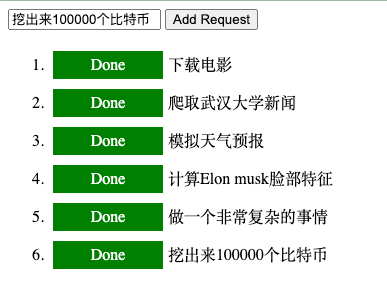

# Install

```bash
pip3 install -r requirements.txt
```

# Run Server
```bash
python3 main.py
```
then open [http://localhost:5000](http://localhost:5000) in your browser

### Run Worker
```bash
python3 worker.py
```

### Screenshot
